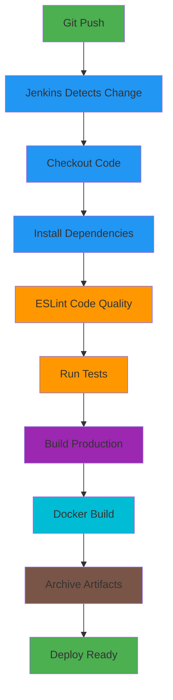
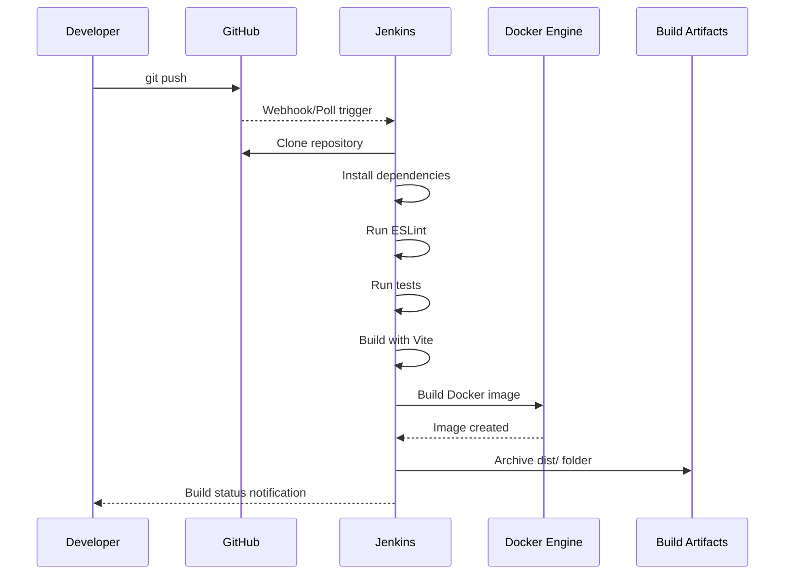

# Infra Monitoring Dashboard

[](https://syedsinan321.github.io/infra-monitoring-dashboard/)
[](https://github.com/syedsinan321/infra-monitoring-dashboard)

A modern, glassmorphic infrastructure monitoring dashboard built with React. This is a fully static demo application that uses mock data to showcase a unified view of datacenter infrastructure — from UCS chassis and blade servers to VMware capacity planning and TPM key management.


---

## Demo

👉 **[View Live Demo](https://syedsinan321.github.io/infra-monitoring-dashboard/)**

The dashboard includes dark/light mode toggle, animated backgrounds, and glassmorphic UI panels. Navigate between six pages using the sidebar.

---

## Overview

This dashboard provides a single-pane-of-glass view into enterprise infrastructure, combining Cisco UCS hardware inventory with VMware virtualization metrics. It is designed for infrastructure and platform engineering teams who need real-time visibility across physical and virtual layers.

All data in this demo is generated client-side using realistic mock data — no backend or API server is required.

---

## Tech Stack

| Layer        | Technology                          |
|-------------|--------------------------------------|
| Framework   | React 18 with Hooks                  |
| Build Tool  | Vite 5                               |
| Styling     | Tailwind CSS 3 with custom glassmorphism |
| Charts      | Recharts 2                           |
| Icons       | Lucide React                         |
| Routing     | React Router v7                      |
| Export      | SheetJS (xlsx) for CSV/Excel export  |

---

## CI/CD Pipeline

This project implements a complete CI/CD pipeline using Jenkins, Docker, and automated testing to demonstrate DevOps best practices.

### Pipeline Architecture



### Pipeline Stages

| Stage | Description | Tools | Duration |
|-------|-------------|-------|----------|
| **Checkout** | Clone repository from GitHub | Git | ~2s |
| **Install Dependencies** | Install npm packages with legacy peer deps | npm | ~3s |
| **Lint** | Code quality checks with ESLint | ESLint 10 | ~1s |
| **Test** | Run unit/integration tests | npm test | <1s |
| **Build** | Create optimized production bundle | Vite | ~2s |
| **Docker Build** | Containerize application | Docker | ~45s |
| **Archive Artifacts** | Save build files in Jenkins | Jenkins | ~1s |

### Build Metrics

- **Total Pipeline Duration:** ~55 seconds
- **Production Bundle Size:** 710 KB (193 KB gzipped)
- **Docker Image Size:** ~50 MB (multi-stage build)
- **Code Quality:** 0 errors, 22 warnings (non-blocking)

### CI/CD Workflow



### Infrastructure as Code

The entire pipeline is defined in `Jenkinsfile` using declarative syntax:

- **Version controlled** - Pipeline configuration lives in Git
- **Reproducible** - Same build process every time
- **Auditable** - Full history of pipeline changes
- **Portable** - Can be deployed to any Jenkins instance

### Docker Multi-Stage Build

The `Dockerfile` uses a two-stage build process:

1. **Build Stage** - Node.js 18 Alpine for building the React app
2. **Production Stage** - Nginx Alpine for serving static files

This reduces the final image size by ~80% compared to single-stage builds.

### Running the Pipeline Locally

#### Prerequisites

- Docker Desktop installed
- Git configured

#### Setup Jenkins

```bash
# Create Docker network
docker network create jenkins

# Run Jenkins container
docker run -d \
  --name jenkins \
  --network jenkins \
  -p 8080:8080 \
  -p 50000:50000 \
  -v jenkins_home:/var/jenkins_home \
  -v /var/run/docker.sock:/var/run/docker.sock \
  --user root \
  jenkins/jenkins:lts

# Install Docker in Jenkins
docker exec -u root jenkins apt-get update
docker exec -u root jenkins apt-get install -y docker.io
docker restart jenkins

# Get initial admin password
docker exec jenkins cat /var/jenkins_home/secrets/initialAdminPassword
```

#### Configure Jenkins Job

1. Open `http://localhost:8080` and complete setup wizard
2. Install suggested plugins + NodeJS plugin
3. Configure NodeJS 20 LTS in **Manage Jenkins** → **Tools**
4. Create new Pipeline job pointing to this repository
5. Set polling schedule: `H/5 * * * *` (checks every 5 minutes)

#### Trigger Builds

Builds are triggered automatically when you push to GitHub (via polling):

```bash
git add .
git commit -m "Your changes"
git push
```

Jenkins will detect the change within 5 minutes and start a new build.

### Build Artifacts

After each successful build, Jenkins archives:

- Production-ready static files (`dist/` folder)
- Docker image tagged with build number
- Build logs and test results

Access artifacts via Jenkins UI → Build → Artifacts

### Running with Docker

```bash
# Build the Docker image
docker build -t infra-dashboard .

# Run the container
docker run -p 3000:80 infra-dashboard

# Access at http://localhost:3000
```

### DevOps Best Practices Demonstrated

✅ **Infrastructure as Code** - Jenkinsfile and Dockerfile in version control  
✅ **Automated Testing** - ESLint and test stages prevent bad code from deploying  
✅ **Containerization** - Docker ensures consistent deployments across environments  
✅ **Build Versioning** - Each build tagged with unique number  
✅ **Artifact Management** - Build outputs archived for rollback capability  
✅ **Clean Builds** - Workspace cleanup prevents contamination  
✅ **Multi-Stage Builds** - Optimized Docker images for production  

---

## Features

### Infrastructure Dashboard
- Summary cards for chassis, blades, FIs, and server profiles
- Domain overview widgets with port utilization
- Expandable chassis/blade inventory with slot utilization bars
- Fabric Interconnect and Network Switch sections grouped by domain
- Server Profiles grouped by chassis with config state indicators
- Unified search across all device types
- Bulk serial number lookup with CSV export

### Host Inventory
- ESXi host tracking with first-seen/last-seen timestamps
- Filter by datacenter, cluster, and active/removed status
- Sortable columns with live search
- Sync trigger for inventory refresh

### Capacity Planning
- Cluster CPU and memory utilization with color-coded status bars
- Horizontal bar charts (top 10 / all clusters)
- Time series line charts for CPU, memory, and storage trends
- Datastore cluster storage utilization table
- Top hosts and VMs by CPU/memory usage
- VM congestion metrics (CPU Ready, Co-Stop)
- Per-datacenter filtering

### ESXi Build Versions
- Cluster-level ESXi version and build tracking
- Filter by datacenter, version, and build number
- Grouped display by datacenter with host counts

### VMware Tools Audit
- Full VM inventory with OS and tools version
- OS distribution bar chart
- Filter by datacenter, OS, tools version, or missing tools
- Grouped tables by datacenter with sortable columns

### TPM Recovery Keys
- Password-protected page (mock authentication)
- TPM status badges (Enabled, Disabled, Present, Not Found)
- Recovery key display with one-click copy
- Collection log viewer with live status
- JSON import and refresh capabilities

### UI/UX
- Dark/Light mode toggle with localStorage persistence
- Animated canvas background with aurora orbs and particles
- Liquid glass panels with prismatic shimmer edges
- Fully responsive layout with collapsible sidebar
- Smooth transitions and hover effects throughout

---

## Purpose

This project demonstrates a production-quality frontend for infrastructure monitoring without requiring access to real Cisco Intersight or VMware APIs. It serves as:

- A **portfolio piece** showcasing modern React, data visualization, and UI design
- A **design prototype** for infrastructure teams evaluating dashboard layouts
- A **reference implementation** for glassmorphic UI patterns with Tailwind CSS
- A **starting point** that can be connected to real backend APIs by swapping out the mock data layer in `src/api.js`

---

## Getting Started

```bash
# Install dependencies
npm install

# Start dev server
npm run dev

# Build for production
npm run build
```

The app will be available at `http://localhost:5173`.

---

## Project Structure

```
src/
├── api.js                  # Mock API layer (swap for real endpoints)
├── mockData.js             # Generated placeholder data
├── App.jsx                 # Root with routing
├── main.jsx                # Entry point
├── index.css               # Tailwind + custom glassmorphism styles
├── ThemeContext.jsx         # Dark/light mode provider
├── SidebarContext.jsx       # Sidebar collapse state
├── components/
│   ├── Layout.jsx           # Main layout with sidebar
│   ├── Sidebar.jsx          # Navigation sidebar
│   ├── Header.jsx           # Page header
│   ├── ThemeToggle.jsx      # Dark/light toggle
│   ├── FiberBackground.jsx  # Animated canvas background
│   ├── SummaryCards.jsx     # Dashboard summary cards
│   ├── ChassisSection.jsx   # Chassis/blade inventory
│   ├── DomainWidgets.jsx    # Domain overview cards
│   ├── FabricInterconnectSection.jsx
│   ├── NetworkSwitchesSection.jsx
│   ├── ServerProfilesSection.jsx
│   ├── SearchBar.jsx        # Search + bulk serial lookup
│   ├── LoadingSpinner.jsx
│   └── ErrorMessage.jsx
└── pages/
    ├── DashboardPage.jsx
    ├── HostInventoryPage.jsx
    ├── CapacityPlanningPage.jsx
    ├── VMwareToolsPage.jsx   # ESXi build versions
    ├── VMToolsPage.jsx       # VMware tools audit
    └── TPMKeysPage.jsx
```
